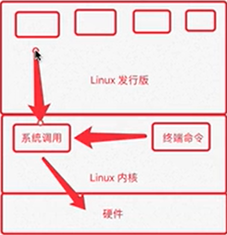
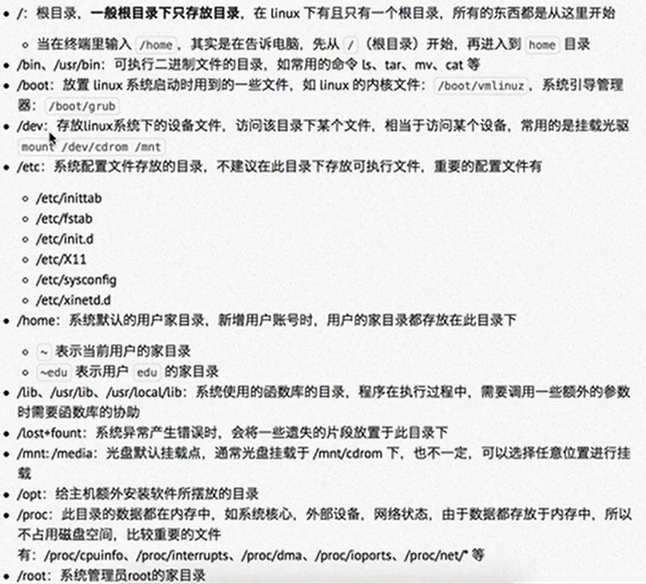
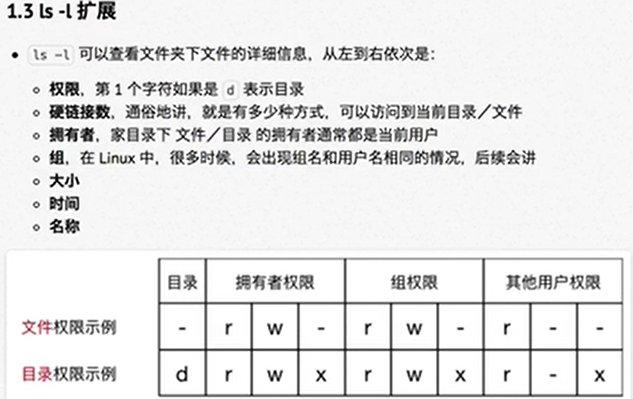
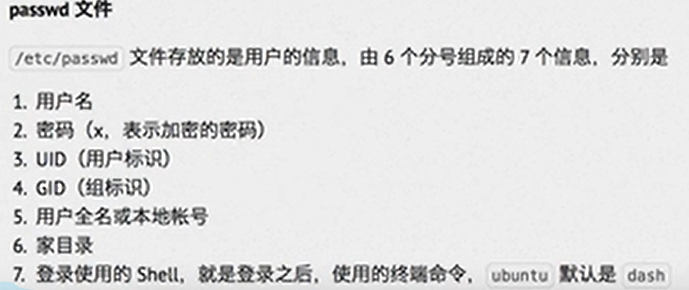
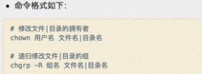
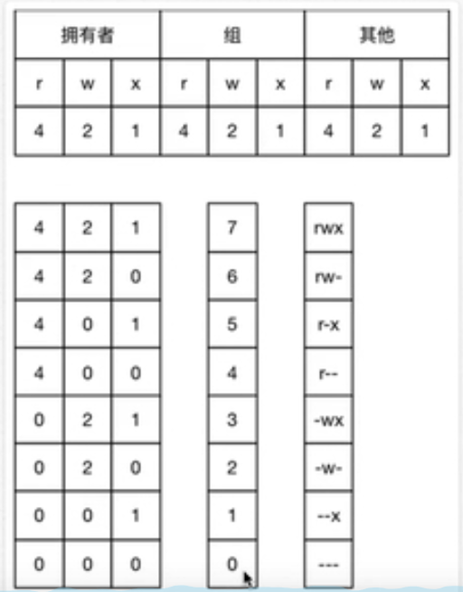
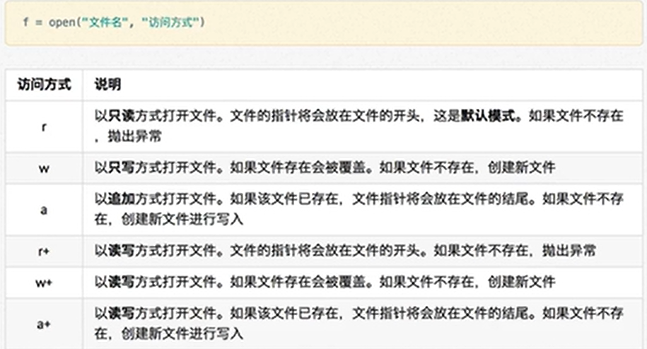

# 零基础学python

## linux基础

### 01 .操作系统简介

1. 桌面操作系统
   - windows
   - mac os
   - linux
2. 服务器操作系统
   - linux:稳定、安全、免费、占有率高。
   - windows server: 付费、占有率底。
3. 嵌入式操作系统
   - linux
4. 移动操作系统
   - android
   - ios

### 02. 内核版本及其发行版本

- 内核版本（如图）：硬件与软件的连接。

- 发行版本：在内核的基础上的拓展。

  

### 03. linux系统下的目录

- `/`：根目录

- `/bin`：系统命令目录

- `etc`：系统配置文件

- `/home`:保存用户账号

  

### 04. linux终端常用操作命令

|       `ll`       |        当前文件夹下的文件        |
| :--------------: | :------------------------------: |
|      `pwd`       |           当前所在位置           |
|  `cd [目录名]`   |            进入该目录            |
| `touch [文件名]` | 打开这个文件，若没有则创建该文件 |
|  `mkdir [目录]`  |             创建目录             |
|  `rm [文件名]`   |            删除该文件            |
|     `clear`      |               清屏               |

#### 1.1查阅该命令的使用方式：

- `[命令] --help`:该命令的帮助

- `man [命令名]：`手册

  | 操作键  |      功能       |
  | :-----: | :-------------: |
  |  空格   |   翻到下一屏    |
  | enter键 |  一次 滚动一行  |
  |    b    |    回滚一屏     |
  |    f    |    前滚一屏     |
  |    q    |      退出       |
  | /world  | 搜索world字符串 |

  

#### 1.2文件和目录常用命令：

- 查看目录内容

  - `ls`

    cha

- 切换目录

  - `cd`

    

- 创建和删除操作

  - `touch`

  - `mkdir`

  - `rm`

    

- 拷贝和移动文件

  - `cp`

  - `mv`

    

- 查看文件内容

  - `cat`

  - more

  - grep

    

- 其他

  - `echo`

  - 重定向`>`和`>>`

  - 管道`|`

    

#### 1.3`ls`命令的使用

|  `ls -l`   | 文件以列的形式展示 |
| :--------: | :----------------: |
| `ls -l -h` |      显示大小      |
|  `ls -a`   |    显示隐藏文件    |

#### 1.4ls通配符的使用

| 通配符  |              含义              |
| :-----: | :----------------------------: |
|   `*`   |          代表任意字节          |
|  `？`   |          代表一个字节          |
|  `[]`   | 代表可以匹配字符组中的任意一个 |
| `[1-3]` |   代表当前字节，在这一范围内   |

#### 1.5mkdir命令的拓展

|        命令        |    作用    |
| :----------------: | :--------: |
| `mkdir -p a/b/c/d` | 创建目录树 |

> **注意：**
>
> 在linux中目录和文件不能重名。 

#### 1.6 拷贝和移动文件

|                命令                 |               作用               |
| :---------------------------------: | :------------------------------: |
|           `tree [目录名]`           |    以树状图列出文件的目录结构    |
|  `cp [原文件地址] [目标文件地址]`   |             复制文件             |
| `cp -i [原文件地址] [目标文件地址]` |           询问是否覆盖           |
| `cp -r [原文件地址] [目标文件地址]` |             复制目录             |
|  `mv [原文件地址] [目标文件地址]`   | 移动文件或目录（可以用作重命名） |
| `mv -i [原文件地址] [目标文件地址]` |          覆盖前进行提示          |
|         `tree -d [目录名]`          |       显示该目录下的文件夹       |

查看文件内容

|          命令           |                     作用                     |
| :---------------------: | :------------------------------------------: |
|     `cat [文件名]`      |         查看文件内容（显示全部文件）         |
|     `more [文件名]`     | 分屏显示文件内容（只显示部分内容，空格翻页） |
| `grep [搜索文本文件名]` |                                              |

#### 1.7`cat`命令的拓展

|       命令        |        功能        |
| :---------------: | :----------------: |
| `cat -b [文件名]` | 对非空输出行做编号 |
| `cat -n [文件名]` |   对所有行做编号   |

> 小技巧：
>
> `nl [文件名]` == `cat -b [文件名]`命令

#### 1.8`grep`命令的使用

`grep`命令可以搜寻文本文件里的内容：

| grep选项 |                功能                |
| :------: | :--------------------------------: |
|   `-n`   |          显示匹配行及行号          |
|  `-vn`   | 显示不包含匹配字符的所有行（取反） |
|  `-in`   |             忽略大小写             |

**常用的两种模式查找**

| 参数 |      功能       |
| :--: | :-------------: |
| `^a` | 搜索以a开头的行 |
| `b$` | 搜索以b结尾的行 |

#### 1.9重定向功能的使用

`echo [内容]`：可以将内容在终端处输出。

配合：

- ">"：将终端中的显示内容，重定向到指定文件，为覆盖。

- `>>`功能相同，为追加。

  

#### 1.10`|`管道

功能：将一个命令的输出，通过管道，作为下一个命令的输入。

常用的管道命令：

- `more`：分屏显示内容。
- `grep`:将终端内容输入到指定文件。

### 05. 远程管理常用命令

#### 1.1目标

- 关机重启

  - `shutdown`

    

- 查看或配置网卡信息

  - `if config`

  - `ping`

    

- 远程登陆和复制文件

  - `ssh`

  - `scp`

    

####  1.2 关机重启

|                 命令                 |     功能     |
| :----------------------------------: | :----------: |
|       `shutdown [选项] [时间]`       |     关机     |
| `shutdown -r now（可以18：00或+10）` | 现在重新启动 |
|            `shutdown -c`             |   取消重启   |

>  注意：
>
>  `shutdown`:默认一分钟后关闭系统。
>
>  远程维护主机时，一般只重启，不关闭。
>
>  

#### 1.3 查看网卡和IP地址

|      命令       |                 功能                 |
| :-------------: | :----------------------------------: |
|   `ifconfig`    |        查看/配置网卡中的信息         |
| `ping [ip地址]` | 检测本电脑与目标IP地址的连接是否正常 |

#### 1.4 远程登陆和复制文件

| 命令               | 功能       |
| ------------------ | ---------- |
| `ssh [用户名] @ip` | 访问服务器 |
|                    |            |

常见服务端口号

|   服务    | 端口号 |
| :-------: | :----: |
| ssh服务器 |   22   |
| web服务器 |   80   |
|   HTTPS   |  443   |
| FTP服务器 |   21   |

#### 1.5 ssh客户端的简单使用

功能：远程控制服务器操作。

`ssh (-p port) [user] remote`

- `user`:用户名。

- `remote`：远程服务器的域名或ip。

- `-p poart`:如果不是默认的“22”端口，可修改端口。

  

> windows中可使用putty和xshell客户端软件	
>
> putty：[https://www.chiark.greenend.org.uk/~sgtatham/putty/latest.html](https://www.chiark.greenend.org.uk/~sgtatham/putty/latest.html)
>
> xshell:[https://www.netsarang.com/en/xshell/](https://www.netsarang.com/en/xshell/)
>
> 提示：输入`exit`断开putty连接。

#### 1.6 scp（掌握）

`secure copy`: 功能是在linux下远程拷贝文件的命令。

注意：地址格式和ssh基本相同，只不过`-p`为大写。

> 举例：`scp -P 22 01.py user@remote:Desktop/01.py`:将本地的01.py复制到服务器上的01.py。

#### 1.7 FilezZilla的使用：

功能：多个文件的复制粘贴。

> 注意：使用的是scp服务，`故端口号为21`

#### 1.8 ssh的免密登陆

- 配置公匙
  - 执行：`ssh-keygen`:生成公钥。
- 上传公匙到服务器
  - `ssh-copy-id -p port [user@remote]`:让远程服务器记住公钥

#### 1.9 配置别名

功能：一般登陆服务器输入：`ssh -p port user@remote`,若配置好别名，可简化命令为：`ssh me`。

创建步骤：

- 在`~/.ssh/config`里追加以下内容：

  ```
  Host me
  	HostName [ip地址]
  	User [python]
  	Port 22
  ```

  

### 05. 用户和权限的基本概念

#### 1..1 用户权限的概念：

用户权限：

- 读
- 写
- 执行

#### 1.2 组的概念

目的：相同权限的账号集合，如：开发组、运维组。

|             命令              |                             功能                             |
| :---------------------------: | :----------------------------------------------------------: |
|       `groupadd [组名]`       |                            添加组                            |
|      `groupdell [组名]`       |                            删除组                            |
|        `cat/etc/group`        |                            确认组                            |
| `chgrp (-R) 组名 文件/目录名` | 修改文件/目录的所属组(R可以用递归的方式将目录下的组全部修改) |

> 注意：要使用超级管理权限：`sudo`
>
> 查看是否添加成功：`~/etc/group`
>
> 

#### c1.3 chmod简单使用（重要）

权限管理：代码`chmod [-或者+]中间不空[r或者w或者x] 【文件名或者目录名】`

#### 1.3 ls -l的扩展：




### 06. 用户管理终端命令

> 提示：**创建用户、删除用户、创建密码**

#### 	1.1 简单命令

|               命令                |       功能       |
| :-------------------------------: | :--------------: |
|   `useradd -m -g [组] [用户名]`   |     创建用户     |
|         `passwd [用户名]`         |   修改用户密码   |
|       `userdel -r [用户名]`       |     删除用户     |
| `cat /ect/passwd | grep [用户名]` | 查询是否创建成功 |

####   1.2 查看用户信息

|    命令     |             功能             |
| :---------: | :--------------------------: |
| `ip 用户名` |       查看用户GID和UID       |
|    `who`    | 查看当前登陆的所有用户名列表 |
|  `whoami`   |     查看当前登陆的用户名     |





**usermod**命令

功能：设置用户的**主组**/**附加组**和登陆**shell**。

命令格式： 

主组： 在`etc/passwd`的第四列**GIP**对应的组。

附加组：在`etc/group`最后一列表示该组的用户列表，用于指定用户的**附加权限。

**which**命令

功能： 查看命令保存的位置。

`/bin`: 二进制可执行文件，（主要用于具体应用）。

`sbin/`: 是系统管理员专用的二进制代码存放目录，（主要用于系统管理应用）。

`/user/bin`: 后期安装的软件。

`/user/sbin`:超级管理员，管理系统的程序。

#### 1.3 切换用户的命令

`su [用户]`：切换用户

`su - [用户]`：切换用户并到达家目录

`exit`： 退出当前用户，返回到原先登陆的用户 

`su -`:进入root用户。

### 07. 修改文件权限

| 命令    | 功能           |
| ------- | -------------- |
| `chown` | 修改文件拥有者 |
| `chgrp` | 修改组         |
| `chmod` | 修改权限       |





### 08. 系统信息相关命令

**目标**

- 时间日期
  - `data`: 查看当前时间
  - `cal`：查看日历，参数`-y`可查看一年的日历 
- 磁盘和目录空间
  - `df -h`： 磁盘剩余空间
  - du -h [目录名]`： 显示目录文件大小
- 进程信息
  - `ps [a/u/x]`​：a:显示所有在终端上的进程， au：多显示用户名和cpu、内存占有率。aux： 在电脑上运行的所有进程。
  - `top`： 动态显示，按`q`退出
  - `kill （-9） [进程名]`：`-9`强制杀死进程

### 09. 其他命令

- 查找文件

  - `find`:命令：`find [路径] -name '*.py'`查找指定文件下扩展名是.py的文件

- 软链接

  - `lin`：就是快捷键的意思，`lin -s [完整路径] [链接名]`:

    > 使用绝对路径。
    >
    > 硬链接不会被源文件影响，软连接更像指针。

- 打包和压缩

  - `tar`：

    - 打包命令：`tar -cvf [打包命名.tar] [被打包文件的绝对路径]`

    - 解包命令：`tar -xvf [打包文件名.tar]`

    - 压缩代打包: (gzip)`tar -zcvf <同上>`,或(bzip2)`tar -jcvf <同上>`

      > **bzip2**:另一种压缩方式，扩展名：`.bz2`

  - `gzip`: 压缩命令，一般压缩打包后的文件扩展名为：`文件.tar.gz`

- 软件安装

  - `apt-get`
    - 安装：`sudo apt install [软件名]`
    - 卸载：`sudo apt remove [软件名]`
    - 升级：`sudo apt upgrade`


## 2. python基础

### 01. 方向


### 02. 新增

因为基础已经有所了解，故只记录新学内容

- 开发小程序时，可以分为两个文件，一个为主程序文件，一个为工具文件。

- 空缺开发工作可用，`# TODO（开发者）`来提示开发

- `print("name", end ="\t\t")`，表示打印内容之间以空格作为间隔

- **Linux**：中的shabin功能，`#! /user/bin/python3`:可以直接执行`.py`结尾的文件。

- `id()`可查看数据的内存地址，在python中参数和数据是分开的。

- python中的哈希函数：用于特征识别，只能用于不可变数据类型

  ```python
  a = hash("hello")
  print(a)
  # -7511181849370986079
  ```

- **在函数内部修改全局变量**：使用`global num`再修改才生效

- 全局变量在函数内部使用时，不必在意写的位置。全局变量位置的影响，只和调用函数语句的位置有关。

- **return**:返回元组的时候可以省略小括号，可以用多个变量来接受函数返回的元组。`name, phone = result()`

- **变量互换**：`a, b = b, a`等号后面为元组

- **列表使用 +=**：相当于调用列表的`xetend`方法

- **缺省参数**：函数默认值，缺省参数应该放在函数的末尾，例如：`def title(name, phone, email=12345):`

- `def demo(num, *nums, **number)`,在该函数中一个`*`代表可输入元组，`**`代表字典

- **拆包**：防止把字典当成元组的元素传递到函数中去。

  ```python
  def demo1(*name, **aaa):
      print(name, aaa)
  name = (1, 2, 3)
  aaa = {
      "name":"xiao",
      "phone":"1234"
  }
  demo1(*name, **aaa)
  # 结果为(1, 2, 3) {'name': 'xiao', 'phone': '1234'}
  ```

  

- **递归**: 要有条件语句，跳出死循环

  ```python
  def news(num):
      print(num)
      if num == 1:
          return
      news(num - 1)
  news(10)
  ```

  

  

- **面向对象**：
  
- 面向过程：根据用户的执行顺序（过程）来，进行编程。
  
  - 面向对象：将问题进行抽象，每个对象中只有一个类。（大驼峰命名法）
    - 类名：类的取名，（鸟类）
    
    - 属性：这类事物的特征（头，尾巴，翅膀）
    
    - 方法：这类方法的特征（吃米，吃饲料）
    
    - 举例：
    
      ```python
      class Cat:
          def eat(self):
              """吃鱼"""
              print("小猫爱吃鱼")
      
          def drink(self):
              print("小猫爱喝水")
      
      tom = Cat()
      tom.drink()
      tom.eat()
      ```
    
      
    
    - 不同对象调用的同一个类，内存地址也不同
    
    - 可以给类增加属性：`cat().name ="tom"`(不推荐)
  
- **三大特性**：
  
    - 封装：将功能属性封装到类中
    
  - 继承：子类拥有父类的所有**方法**和**属性**（可以复用代码，不用重复编写）
    
  - 多态：
  
- **初始化方法**：当给对象创建类的时候，`tom = cat()`会自动调用初始化方法（属性）`__init__`
  
- **删除对象**：`del [对象名]`删除对象
  
- **内置方法**：
  
  1. `__init__`:创建对象时自动执行的，类的属性方法。
  
  2. `__del__`:销毁对象（删除给对象分配的内存空间）时，自动执行的方法。
  
  3. `__str__`:当调用类时，自动返回的字符串。必定要有`return`返回字符串
  
       ```python
       class Cat:
           def __init__(self, name):
               self.name = name
               print("%s 来了" % self.name)
       
           def __del__(self):
               print("%s去了" % self.name)
       
           def __str__(self):
       
             return "我是小猫【%s】" % self.name
       
       tom = Cat("tom")
       print(tom)
       print("-"*50)
     ```
  
       
  
- **实例**：房屋家具搭配
  
    ```python
    class HouseItem:
        """创建家具类"""
    
        def __init__(self, name, area):
            
            self.name = name
            self.area = area
    
        def __str__(self):
    
            return "【%s】占地 %.2f" % (self.name, self.area)
    
    class House:
        """创建房子"""
    
        def __init__(self, house_type, area):
            
            self.house_type = house_type
            self.area = area
    
            # 剩余面积
            self.free_area = area
    
            # 家具列表
            self.item_list = []
    
        def __str__(self):
    
            return ("户型：%s\n总面积：%.2f【剩余：%.2f】\n家具：%s" 
                    % (self.house_type, self.area, self.free_area, self.item_list))
        
        def add_item(self, item):
    
            print("要添加%s" % item)
    
            # 1.对家具的面积进行判断
            if item.area > self.free_area:
                print("%s的面积太大，无法添加" % item.name)
    
                return
    
            # 2. 将家具名添加到列表中去
            self.item_list.append(item.name)
    
            # 3. 计算剩余的面积
            self.free_area -= item.area
    
    
    # 创建家具
    bed = HouseItem("席梦思", 40)
    chest = HouseItem("衣柜", 20)
    
    # 创建房子对象
    house = House("两室一厅", 60)
    house.add_item(bed)
    house.add_item(bed)
    house.add_item(chest )
    
    print(house)
  ```
  
  
  
- **实例**：士兵突击（一个对象的属性，可以是另一个类）
  
    - 当给属性赋值的时候，不知道赋予什么值。可以用`None`填补位置
    
    - 身份运算符：`is`或者`is not`用来判断对象的内存地址是否相同
    
      ```python
      class Gun:
          
          def __init__(self, model):
      
              # 1. 枪的型号
              self.model = model
      
              # 2. 剩余子弹数量
              self.bulled_count = 0
      
          def add_bulled(self, count):
      
              self.bulled_count += count
          
          def shoot(self):
      
              # 1. 判断子弹数量
              if self.bulled_count <= 0:
      
                  print("子弹已经用光，请装填子弹")
                  return
      
              # 2. 发射子弹
              self.bulled_count -= 1
      
              # 3. 提示发射信息
              print("【%s】突突突.....【%d】" % (self.model, self.bulled_count))
      
      class Soldier:
      
          def __init__(self, name):
      
              # 1. 姓名
              self.name = name
      
              # 2. 枪 -新兵没有枪
              self.gun = None
      
          def fire(self):
      
              # 1. 判断是否有枪
              if self.gun is None:
                  print("%s还没有枪" % self.name)
      
                  return
              
              # 2. 高喊口号
              print("冲呀.....%s" % self.name)
      
              # 3. 让枪装上子弹
              self.gun.add_bulled(50)
      
              # 4. 让枪发射子弹
              self.gun.shoot()
      
      
      ak47 = Gun("AK47")
      
      xusanduo = Soldier("许三多")
      xusanduo.gun = ak47
      xusanduo.fire()
      print(xusanduo)*
      ```
    
- **私有属性/私有方法**：私有属性和私有方法在外界（类之外）不能被调用，形式：`__age`
  
- **(不推荐)访问私有属性和方法**：`对象._[类名]__方法`
  
- **继承**：实现方式：`class lei()`新建类的时候添加一个小括号就行
  
    - **专业术语**：（子类、父类、继承）（派生类、基类、派生）
    - **继承的传递性**
    - **继承的更新**：（如果父类和子类中的该方法完全不同）当在子类中重写了父类的方法，就可以更新该对象的方法。
  - **父类的扩散**：（如果在子类中对父类的方法进行重写，但又需要一部分该方法）可以使用`super().[父类方法]`来调取父类方法。（**了解**：以前在子类中调用父类方法的时候，用`父类名.方法（self））`方式,类似于函数 的调用)
  
- **多继承**：子类拥有多个父类`class A(B, C)：`
  
  - **MRO**:方法搜索顺序
  
  - **建议**：给类赋予基类，用于适应pyton2版本。
  
      ```python
      class A(object):
          pass
    ```
  
- 实例就是对象
  
- **类属性和实例属性**：类属性可以查看这个类赋予了多少个实例。
  
  示例
  
    ```python
    class Tool(object):
    
        # 调用的次数
        count = 0
    
        def __init__(self, name):
    
            self.name = name
            
            # 让类属性+1
            Tool.count += 1
    
    # 创建工具对象
    tool1 = Tool("斧头")
    
    print(Tool.count)
    ```
  
    
  
- **向上寻找类属性**：在对实例调取类属性时，先查找实例内存中是否有类属性，没有就去类的内存中寻找类属性。推荐使用`[类名].类属性`
  
- **类方法**：
  
  - 语法如下：
  
      ```pyhton
      @classmethod
      def 类方法名(cls):
      	pass
    ```
  
    
  
- **静态方法**：在类中，既不调用类属性、类方法，也不调用实例属性、实例方法
  
  - 语法如下：
  
      ```python
      @staticmethod
      def 静态方法():
          pass
    ```
  
- 综合练习：
  
    ```python
    class Game(object):
    
        top_score = 0
    
        def __init__(self, name):
            self.name = name
    
        @staticmethod
        def show_help():
            print("帮助信息：不让僵尸进入大门")
    
        @classmethod
        def show_top_score(cls):
            print("历史记录:%d" % cls.top_score)
    
        def start_game(self):
            print("%s开始游戏了" % self.name)
    
    # 1. 查看游戏的帮助信息
    Game.show_help()
    
    # 2. 查看历史最高分
    Game.show_top_score()
    
    # 3. 创建游戏对象
    game = Game("小明")
    game.start_game()
  ```
  
  
  
- **单例设计模式**：内存中只有一个对象。（音乐播放）
  
  - 通过控制`__new__`方法来控制内存。
  
      ```python
      class Music(object):
      
          instance = None
      
          def __new__(cls, *args, **kwargs):
      
              # 1. 判断类属性是否为空对象
              if cls.instance is None:
                  # 2. 调用父类的方法分配空间
                  cls.instance = super().__new__(cls)
      
              # 3. 返回类属性保存的对象
              return cls.instance
      
      
      play = Music()
      play2 = Music()
      print(play)
      print(play2)
      """输出：
      <__main__.Music object at 0x000001E68646F198>
      <__main__.Music object at 0x000001E68646F198>
      """
    ```
  
    
  
- **`__new__`方法**：给对象分配空间，（**注意**：在重写`__new__`方法的时候，一定要返回内存地址`return ）
  
    ```python
    class Music(object):
        def __new__(cls, *args, **kwargs):
    
            # 1. 创建对象，new方法会自动调用
            print("创建对象，分配空间")
    
            # 2. 为对象创建空间
            instance = super().__new__(cls)
            
            # 3. 返回对象的引用
            return instance
    
        def __init__(self):
            print("播放器初始化")
    
    player = Music()
    print(player)
  ```
  
  
  
- 类的梳理：
  
    - 父类
      - 父对象方法的调用`super().方法`
    - 子类
      - 类属性
      - 类方法：`__name(cls)
        - 调用类属性:`cls.属性`
      - 对象属性:
        - 保存在`__init__`中
        - 调用类属性：`
      - 对象方法


### 03. 异常

#### 1.0 抛出异常

**定义**，并提示错误信息

#### 2.0 捕获异常

语法：

```python
try:
    尝试执行的代码
except:
    出现错误的处理
```

简单演示：

```python
"""
对输出结果报错的处理
"""

try:
    num = int(input("请输入除数："))

    result = 8 / num
    print(result)
except ValueError:
    print("请输入合适的数值")
except ZeroDivisionError:
    print("分母不能为零")
```

捕获未知错误的语法：

```python
except Exception as result:
    print("未知错误%s" % result)
```

完整处理异常的语法：

- （无异常）尝试执行的代码----else----finally

- （有异常）尝试执行的代码----except----finally

  ```python
  try:
      # 尝试执行额代码
      pass
  except 错误类型1:
      # 针对错误类型1进行的处理
      pass
  except 错误类型2：
  	# 针对错误类型2进行处理
      pass
  except (错误类型3，错误类型4)：
  	# 针对34进行的处理
      pass
  except Exception as result:
      # 打印错误信息
      print(result)
  else:
      # 没有异常执行的代码
      pass
  finally:
      # 无论是否有异常，都要执行的代码
      pass
  ```

  

#### 3.0  利用异常的传递性：

可以利用异常传递，来捕获函数中的异常

#### 4.0 抛出raise异常

主动抛出不符合设计规则的异常：例如（限定密码长度）

```python
def pass_world():

    # 1. 提示用户输入密码
    pwd = input("请输入密码：")

    # 2. 判断密码长度>8返回密码
    if len(pwd) >= 8:
        return pwd

    # 3. 判断密码长度<8抛出异常
    else:
        ex = Exception("密码长度不够")
        raise ex
try:
    print(pass_world())

except Exception as result:
    print(result)
```

### 04. 模块 儿

**定义**：python文件

**模块儿接口**：类、函数、全局变量

**导入方式**：`import 模块儿名`

- `import name as n`可以简化模块儿名

- `from name import lisname`可以直接导入模块儿有用部分

- `from name import *`(可导入所有功能，不需要`模块儿.`的方式)<不推荐，容易出现重名>

  

**调用顺序**：相同函数名，后导入的函数会把先导入的函数覆盖掉。

**文件建立原则**：可以被调用，任何没有缩进的代码都会被执行一遍

**__name__函数**:用来测试当前文档的代码，不会被需要导入的文件执行。

例如：

```python
if __name__ == "__main__":
    print("这是当前文件测试函数")
```

#### 05. 包

**概念**：包含多个py文件的目录，必须有一个**__init__.py的文件**用来可以一次性导入所有模块儿。

**使用方法**：在`init`文件中写入`from . import 模块儿名`（与类中的init函数功能相同，在导入文件夹时先读取init文件）

**发布包(linux)**：

- 创建"setup.py"文件

- 构建模块儿：`python3 setup.py build`

- 生成发布压缩包：`python3 setup.py sdist`

- 安装模块儿：

  - `tar -zxvf 包名.tar,gz`
  - `sudo python3 setup.py install`

  

```python
from distutils.core import setup
setup(name = "hm_message",  # 包名
      version = "1.0",  # 版本
      description = " ",  # 简单描述
      long_description = " ",  # 详细描述
      author = " ",  # 作者
      author_email = " ",  # 作者邮箱
      url = " ",  # 作者主页
      py_moduls = [hm_message.name, 
                  hm_message.noname]
)
```


#### 06. 安装

- (python3) sudo pip3 install pygame
- (python2) sudo pip install pygame

#### 07. 文件操作

- 文件打开（赋予对象）
- 文件读取（文件指针移动到开头）
- 文件写入 
- 文件关闭




#### 07. eval函数：

**功能**：将字符串当有效表达式来求值，并返回计算结果

**案例_计算机**：

```python
input_str = input("请输入要计算的公式：")
print(eval(input_str))
```


> 注意**：
>
> - 在字典中`key`只能为不可变数据类型（除列表和字典）
>
> - 一个元素的元组应该在末尾增加一个“，”号，如：`(a,)`
>
> - 在函数中只能使用全局变量，无法修改全局变量
>
> - 局部变量和全局变量重名时候，pycharm会显示一个黑色的虚线
>
> - **全局变量命名**：一般加`g_`或者`gl_`
>
> - **函数内部修改可变数据**：函数内部调用方法会修改全局变量 
>
> - **多继承**：中父类的方法尽量避免重名
>
> - **新式类和旧式类**：python3中会给类赋予（object）基类。
>
> - **对象访问类属性陷阱**：如果用对象修改类属性，只存在对象的内存地址中，不会变动原来的类属性内容
>
> - **类的对象方法内类的调用**：在类中创建的对象方法中不能用`cls.类属性直接调用`而应该用`类名.类属性`
>
>   举例：
>
>   ```python
>   class Lei(object):
>       name = 0
>   	def __init__(self):
>           cls.name    # 错误
>       	lei.name    # 正确
>   ```
>   
>   
>   
>   
>   
>   

工具：


## 4. 总结

感谢[B站原视频](https://www.bilibili.com/video/av14184325?p=1)，和各位弹幕的陪伴。下一个阶段，python高级编程。路漫漫！！！加油！！！2020.3.17