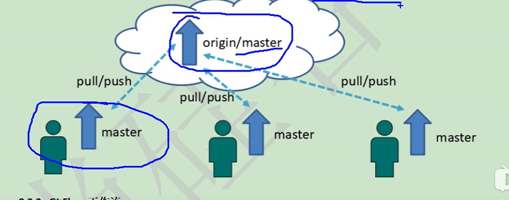
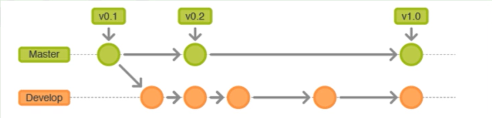
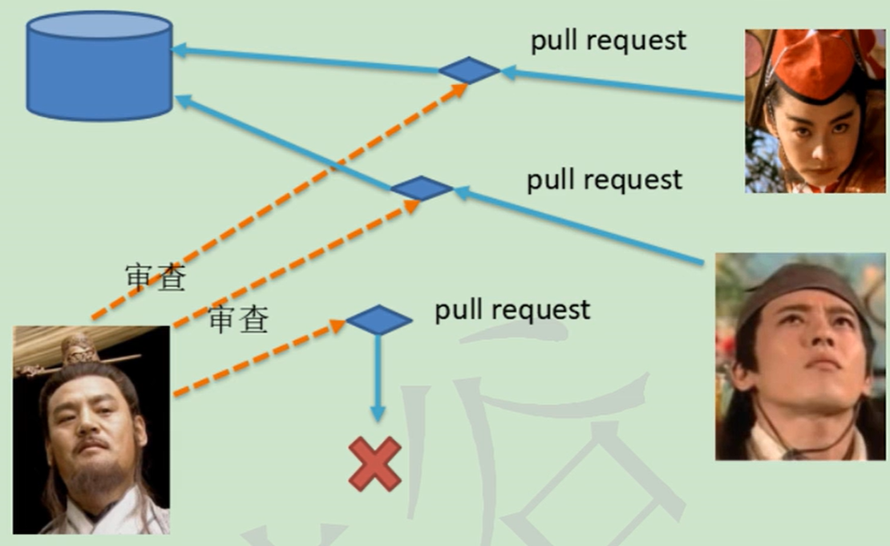
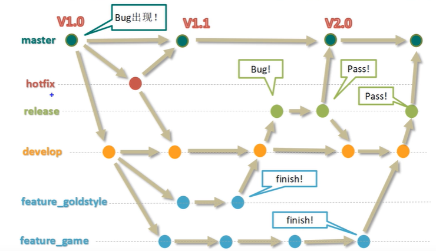

## 目录
[toc]
## 一：版本控制
- 功能
    - 协同修改
    - 数据备份
    - 版本管理
    - 权限控制：可审核未授权代码
    - 历史查看
    - 分支管理：多个小组同时推进
- 版本控制工具
    - 集中式
        - cvs,svn(最多),vss
        - 缺点：容易单点故障，服务器完蛋。
    - 分布式
        - git....
## 二：git简介
- **发展历程**
- [官网地址](https://git-scm.com/)
- **优势**
    - 断网可用
    - 完整性保证
    - 尽可能增加设计，而不删除，修改操作
    - 分支操作的流畅性
    - 与linux的兼容
- **安装**
- **git结构**
    - 工作区
    - 暂存区
    - 本地库
- **git和代码托管中心**
    - 任务：托管远程库
    - 分类
        - 局域网：Gitlab
        - 外网:github,码云
    - 本地库与远程库的两种方式
        - 团队内部协作
        - 跨团队协作
## 三：gti命令行操作
1. **本地库初始化**

| 命令                               | 作用                                 | 注意事项                 |
| ---------------------------------- | ------------------------------------ | ------------------------ |
| ll                                 | 查看本文件夹下的目录                 |                          |
| ls -lA                             | less                                 | 查看隐藏文件目录,按q退出 |
| pwd                                | 查看当前所在位置                     |                          |
| mkdir 文件名                       | 创建文件夹                           |                          |
| cd ..                              | 返回上级目录                         |                          |
| git init                           | 本地库初始化                         |                          |
| git config user.name 用户名        | 项目级别的用户签名                   |                          |
| git config user.email 邮箱         | 项目级别的用户签名                   |                          |
| git config --global                | 系统用户级别                         |                          |
| cd ~                               | 打开家目录                           |                          |
| git status                         | git的状态                            |                          |
| git add good.txt                   | 将文件放在暂存区                     |                          |
| git rm --cached good.txt           | 将缓存区的文件释放出来               |                          |
| git commit good.txt                | 将缓存区提交到本地库                 |                          |
| ：wq                               | vim编辑器的退出方法                  |                          |
| ：set nu                           | vim编辑器的前面数字                  |                          |
| i                                  | 在vim中按i键进入插入模式             |                          |
| git log                            | 访问本地历史记录                     |                          |
| git log --pretty=oneline           | 每行日志只显示一行                   |                          |
| git log --oneline                  | 只显示一部分哈希值                   |                          |
| git reflog                         | 显示返回版本需要移动的步数           |                          |
| git reset --hard "哈希值"          | 通过哈希值返回历史版本               |                          |
| rm 文件名                          | 对文件进行删除                       |                          |
| git diff 文件名                    | 将工作区的文件与本地库的版本进行对比 |                          |
| git branch -v                      | 查看分支                             |                          |
| git branch 名字                    | 添加分支                             |                          |
| git checkout 名                    | 切换分支                             |                          |
| git merge 分支名                   | 抓取该分支上的修改                   |                          |
| git remote -v                      | 查看是否有github上的传送网址         |                          |
| git remote add 保存地址的别名 网址 | 保存远程仓库的网址                   |                          |
| git push 保存地址的别名 分支       | 推送到远程仓库                       |                          |
| git clone 地址                     | 可以将远程库下载到本地               |                          |
| git fetch origin master            | 将远程库下载到本地，但并不合并       |                          |
| git merger origin/master           | 将下载的库合并到本地库               |                          |
| git pull [保存地址的别名] [分支]   | 若远程库修改的很小，直接拉取         |                          |

2. **设置签名**
    - 形式:
    ```
    用户名：neme
    Email地址：123465
    ```
    - 作用：区分不同的开发人员
    - 命令
        - 项目级别/仓库级别：仅在当前项目有效
        - 系统用户级别：登陆当前操作系统的用户范围
        - 二者都有，项目级别优先
    - 保存位置：当前项目下的`.git/config`
    - 技巧：不用打开vim来编辑提交的内容注释：`git commit -m "要写的内容" good.txt`
3. **基础操作**

4. **版本的前进和后退**
    - 方式：
        - 基于索引值`git reset --hard "哈希值"`
        - 使用^符号
        - 使用~符号
    - reset命令的三个参数对比
        - `--soft`参数：
            - 仅仅只在本地库中移动head指针
        - `--mixed`参数：
            - 本地库中移动head指针
            - 重置暂存区
        - `--hard `参数
            - 本地库中移动head指针
            - 重置暂存区
            - 重置工作区


5. **版本对比**
    - `git diff文件名`将工作区的内容和本地库的文件进行对比
    - `git diff [本地库的哈希值]文件名`将工作区的内容和本地库的历史版本进行对比
6. **分支**
    - **分支的好处**：
        - 多功能开发
        - 分支开发失败，不影响其他分支
    - **分支的操作**
        - `git branch -v`查看分支
        - `git branch 名字`创建分支
        - `git checkout 名字`切换分支
    - **合并分支**
        - 第一步：切换到最终合并到的分支
        - 第二步：`git merge 分支名`抓取该分支上的修改
    - **分支冲突解决办法**
        - 第一步：vim编辑文件删除标记符号
        - 第二步：把文件修改到满意的地步
        - 第三步：`git add`提交到缓存区
        - 第四步：`git commit -m "注释"`提交到本地库（注意：不要在后面写入文件名）
7. **github操作**
    - `git clone 地址`可以将远程库下载到本地
    - **clone的三个效果**
        - 下载远程库
        - 创建origin远程地址别名
        - 初始化本地库
    - **远程库抓取**：
        - **fetch的用法**：（远程库被修改的很大）一般不直接合并，先`git fetch origin master`将远程库这个分支抓下来，切换远程库分支查看`git checkout origin/master`,最后命令合并`git merge orgin/master`
        - **pull的用法**（远程库被修改的很小）直接命令`git pull [远程网址的别名（origin）] [分支名]`
    - **跨团对协作**：
        1. 复制主要项目的(clone or download)
        2. 在本团队账号，点击刚复制的网址
        3. 点击右上角"Fork"
        4. 本地修改推送到本团队的远程库
        5. 在本团队github上点击（Pull request）
        6. 点击（create pull reqhuest）:标题，内容。（类似邮件）
        7. 审阅: 在该目录下（create pull reqhuest），点击（commit）查看提交记录，点击（Files changed）查看修改的地方
        8. 合并代码：（Merge pull request）
        9. 将远程库拉取到本地
    - **ssh登陆**
        1. `cd ~`进入家目录
        2. （`rm -r .ssh/`若以前创建过，可删除。）
        3. `ssh-keygen -t rsa -C(注意：大写) [github上邮箱账号]` 
        4. 一路回车用默认值
        5.  `clip < C:/Users/[用户名]/.ssh/id_rsa.pub`使用代码（复制id_rsa）
        6.  粘贴到github上的`SSHkeys`中
        7.  本地修改文件传到本地库
        8.  `git remote add origin_ssh [shh的地址]`增加本地库的remote,ssh地址
        9.  `git push origin_ssh master`推送到远程库
## 四：git图形化界面操作

(各自IDE不同，故不再详细介绍)

## 五：git工作流

### git工作流分类：

- **集中式**：基本上只是将git当作云端代码仓库。所有人都只使用一个分支。

  

- **Gitflow****工作流**（推荐）：不同功能分配不同分支，方便发布迭代。

  

- **Forking工作流**：在gitflow基础上，充分利用pull request功能，能接受不信任者的提交。

- 

  

### gitflow工作流的介绍：

- **分支种类**

  - 主干分支`master`

  - 开发分支`develope`

  - bug修理分支 `hotfix`

  - 预发布分支 `relase`: 发布前的测试。

  - 功能分支 `featurn`

    


## 六：资源申明：

本笔记原视频网站：[https://www.bilibili.com/video/av24441039?p=54](https://www.bilibili.com/video/av24441039?p=54)

感谢"尚硅谷GitHub教程"