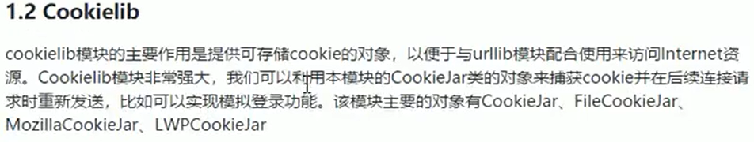
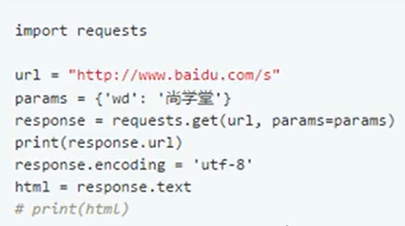
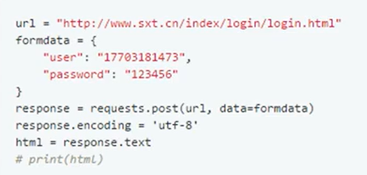
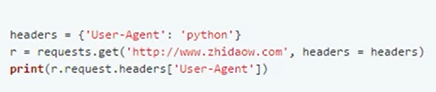
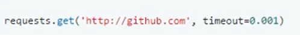
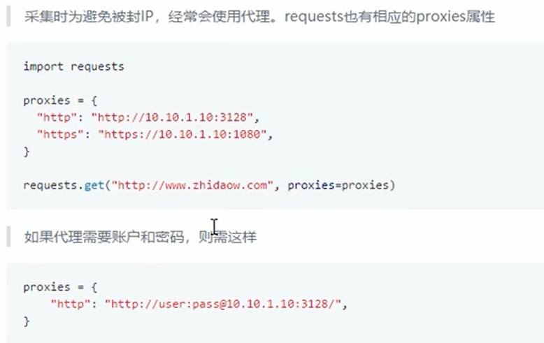
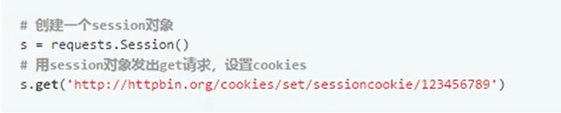
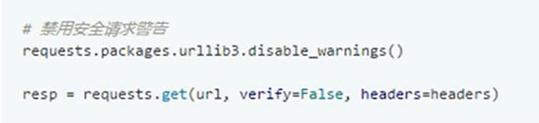
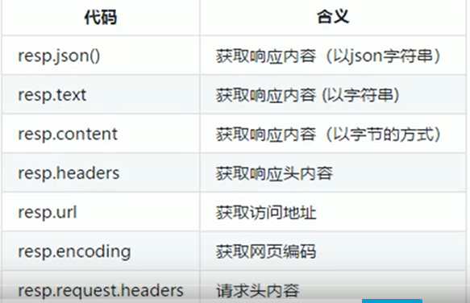
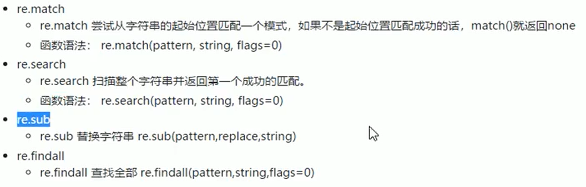

#  爬虫入门

## 1. 爬虫介绍

**掌握的技术**

- [ ] request库的掌握
- [x] 伪装头
- [x] ajax页面
- [x] 需要ca证书的页面
- [x] 设置ip（proxy）代理
- [ ] 正则表达式

## 2. request请求

- 使用函数
  - `from urllib.request import urlopen`(构建返回内容)（返回：非解码字符串）
  - `from urllib.request import Request` （构建请求对象）
  - `from random import choice`（从伪装头列表中，随机选择）

- 准备目标网址url

- 构建伪装头池

- 构建request对象（传入1.2步骤）

- 将构建的对象传入,urlopen函数

- 利用urlopen函数中的read方法，返回二进制字符串

- 解码输出

  > 改进代码：可以引入`fake_useragent`库来实现调用不同伪装头
  >
  > ```python
  > from fake_useragent import UserAgent 
  > ua = UserAgent()
  > print(ua.chrome)
  > ```
  >
  > 

  ```python
  from urllib.request import urlopen
  from urllib.request import Request
  from random import choice
  
  def main():
      # 发送请求
      url = "https://www.baidu.com/"
  
      # 伪装访问身份
      # 构建伪装头代码池子
      user_agent = ["Mozilla/5.0 (Windows NT 10.0; Win64; x64) AppleWebKit/537.36 (KHTML, like Gecko) Chrome/80.0.3987.149 Safari/537.36","Mozilla/5.0(Macintosh;IntelMacOSX10_7_0)AppleWebKit/535.11(KHTML,likeGecko)Chrome/17.0.963.56Safari/535.11","Mozilla/5.0(WindowsNT6.1;rv:2.0.1)Gecko/20100101Firefox/4.0.1"]
      headers = {
          "User-Agent": choice(user_agent)
      }
  
      # 构造请求request
      request = Request(url, headers=headers)
  
      # 构造response对象
      response = urlopen(request)
  
      # 读取内容
      info = response.read()
  
      # 打印内容
      print(info.decode())
  
  
  if __name__ == "__main__":
      main()
  ```

  

## 3. get请求

- 简介：主要用于对不同网址的url访问

- 解决网址中有中文，需要转码的问题
  - `from urllib.parse import quote`方法转码汉语
  - `from urllib.parse import urlencode`传入字典，拼出url

```python
from urllib.request import urlopen
from urllib.request import Request
from random import choice
from urllib.parse import urlencode


def main():
    # 发送请求
    # 传入字典，构建url
    name = input("请输入要搜索的关键字：")
    args = {
        "q":name,
        "ie":"utf-8"
    } 

    url = "https://cn.bing.com/search?{}".format(urlencode(args))

    # 伪装访问身份
    # 构建伪装头代码池子
    user_agent = ["Mozilla/5.0 (Windows NT 10.0; Win64; x64) AppleWebKit/537.36 (KHTML, like Gecko) Chrome/80.0.3987.149 Safari/537.36","Mozilla/5.0(Macintosh;IntelMacOSX10_7_0)AppleWebKit/535.11(KHTML,likeGecko)Chrome/17.0.963.56Safari/535.11","Mozilla/5.0(WindowsNT6.1;rv:2.0.1)Gecko/20100101Firefox/4.0.1"]
    headers = {
        "User-Agent": choice(user_agent)
    }

    # 构造请求request
    request = Request(url, headers=headers)

    # 构造response对象
    response = urlopen(request)

    # 读取内容
    info = response.read()

    # 打印内容
    print(info.decode())


if __name__ == "__main__":
    main()
```


## 4. post 请求

**概念**：用于用户登陆的请求

**浏览器检查设置**：network----preservelog(勾选)----找login.html文件----（看请求头里是否有Form Data账户信息））

## 5. ajax请求

**概念**：动态填充页面的请求，例如：[豆瓣排行](https://movie.douban.com/typerank?type_name=%E5%96%9C%E5%89%A7&type=24&interval_id=100:90&action=)

**浏览器检查设置**：network----XHR(勾选)----在response里----[将内容复制到该网站整理](https://www.json.cn/)

**演示**：爬取豆瓣ajax类型网页

```python
from urllib.request import Request, urlopen
from fake_useragent import UserAgent


def html_one(num):
    # 构建url
    url = "https://movie.douban.com/j/chart/top_list?type=24&interval_id=100%3A90&action=&start={}&limit=1".format(num)

    # 构建伪装头
    ua = UserAgent()
    headers = {
        "User-Agent" : ua.chrome
    }

    # 构建Request
    request = Request(url, headers=headers)

    # 构建返回
    response = urlopen(request)

    # 读取返回值
    recv_data = response.read().decode()
    
    return recv_data


def main():

    # 循环页数
    num = 0
    while True:
        data = html_one(num)
        
        # 判断退出
        if not data or data == "":
            break
        print(data)
        print("---------第{}页-------".format(num/20))
        num += 20

    print("爬取结束")


if __name__ == "__main__":
    main()
```


## 6. https的使用

**概念**：加密的网站，ca证书

**忽略证书**：

- `import ssl`（导入的函数）
- `context = ssl._create_unverified_context()`(写入代码)
  - `response = urlopen(request, context = context`(导入urlopen方法中)


## 7. 设置代理proxy

**概念**：使用代理，来访问网站。

**演示**：

```python
from urllib.request import ProxyHandler
from urllib.request import build_opener

proxy = ProxyHandler({"http":"60.190.23.50"})
opener = build_opener(proxy)
url = "https://cn.bing.com/"
response = opener.open(url)
print(response.read().decode("utf-8"))
```


## 8. cookie

**概念**：身份验证。

**方式**：

- 已经登陆的账号进行cookie登陆

- 无验证码登陆

- 无验证码登陆，保存登陆页cookie并进入

  

**演示一**

```python
from urllib.request import Request, urlopen
from fake_useragent import UserAgent


url = ""
headers = {
    "User-Agent": UserAgent().chrome,
    "Cookie": ''
}
request = Request(url, headers=headers) 
response = urlopen(request)
print(response.read().decode())
```


**演示二**

```python
from urllib.request import Request, urlopen, HTTPCookieProcessor
from fake_useragent import UserAgent
from urllib.parse import urlencode

# 登陆
login_url = ""
headers = {
    "User-Agent": UserAgent().chrome,
}
form_data = {
    "user":"",
    "password":""
}
request = Request(login_url, headers=headers, data=form_data)
# response = urlopen(request) #  构建opener
handler = HTTPCookieProcessor
opener = build_opener(handler)
response = opener.open(request)
print(response.read().decode())


# 访问页面
url = "https://www.zhihu.com/explore"
request = Request(url, headers=headers) 
# response = urlopen(request)
response = opener.open(request)
print(response.read().decode())
```


**演示三**

```python
from urllib.request import Request, build_opener, HTTPCookieProcessor
from fake_useragent import UserAgent
from http.cookiejar import MozillaCookieJar
from urllib.request import urlencode

# 登陆

# 保存cookie到文件中
def get_cookie():

    # 创建url
    login_url = "*****"

    # 构建伪装头
    headers = {
        "User-Agent": UserAgent().chrome
    }

    # 构建伪装用户登陆
    form_data = {
        "user": "*****"
        "pasword":"*****"
    }

    f_data = urlencode(form_data).encode()
    re = Request(login_url, headers=headers, data=f_data)  # 构建请求头


    cookie_jar = MozillaCookieJar()    # 保存cookie文件
    handler = HTTPCookieProcessor(cookie_jar)
    opener = build_opener(handler)  # 构建opener对象
    response = opener.open(re)  # 准备返回值

    # 保存cookie值到文件
    cookie_jar.save("cookie.txt", ignore_expires = True, ignore_discard = True)


# 从文件获取cookie
def use_cookie():
    info_url = "*****"
        # 构建伪装头
    headers = {
        "User-Agent": UserAgent().chrome
    }

    re = Request(info_url, headers=headers,)  # 构建请求头
    cookie_jar = MozillaCookieJar()    # 保存cookie文件
    cookie_jar.load("cookie.txt", ignore_expires = True, ignore_discard = True)
    handler = HTTPCookieProcessor(cookie_jar)
    opener = build_opener(handler)  # 构建opener对象
    response = opener.open(re)  # 准备返回值
    print(response.read().decode())  # 打印结果


# 主函数
def main():
    get_cookie()
    use_cookie()


# 测试函数
if __name__ == "__main__":
    main()
```


## 9. urlerror 

**概念**：处理报错

**演示**：

```python
from urllib.request import urlopen, Request
from fake_useragent import UserAgent

def main():
    # 发送请求
    url = "https://movie.douban.com/j/chart/top_list?type=24&interval_id=100%3A90&action=&start=4000&limit=20"
    headers = {
        "User-Agent": UserAgent().chrome
    }
    try:
        request = Request(url, headers=headers)
        response = urlopen(request)

        # 读取内容
        info = response.read()

        # 打印内容
        print(info.decode())
    
    except URLError as e:
        print(e)
    
    print("访问完成")


if __name__ == "__main__":
    main()
```


## 10. request库的使用

- get请求，参数是字典，也可以是json参数

  

- post请求，参数是字典，也可以是json参数

  

- 自定义请求头

  

- 设置超时时间

  

- 代理访问

  

- 保存cookie

  

- ssl认证

  

- 获取响应信息

  	


## 11. 获取数据----正则表达式

|      模式       |           功能           |
| :-------------: | :----------------------: |
|        ^        |     匹配字符串的开头     |
|        .        |      匹配任一字符串      |
|        $        |     匹配字符串的结尾     |
|      [   ]      |     里面任意一个元素     |
|       re*       |   匹配零个或多个表达式   |
|       re+       |   匹配一个或多个表达式   |
|       re?       |   匹配零个或一个表达式   |
|     re{n,m}     | 匹配n到m次前面正则表达式 |
|       ( )       |     只要括号内的内容     |
|       \w        |  匹配数字，字母，下划线  |
|       \s        |     匹配任意空白字符     |
|       \d        |       匹配任意数字       |
|     \n或\t      |  匹配换行符，匹配制表符  |
| [\u4e00-\u9fa5] |         匹配中文         |
|      re.l       |       不匹配大小写       |


**贪婪模式/非贪婪模式**：获取多或少

**常用方法**：



 	 


## 感 谢

B站视频[https://www.bilibili.com/video/av87613645?p=4](https://www.bilibili.com/video/av87613645?p=4)